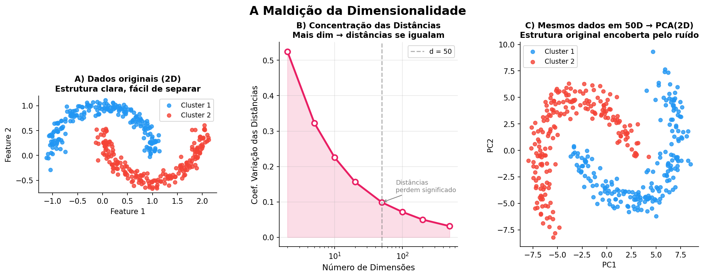
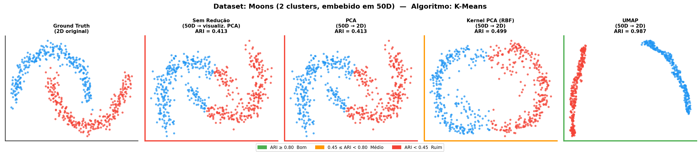
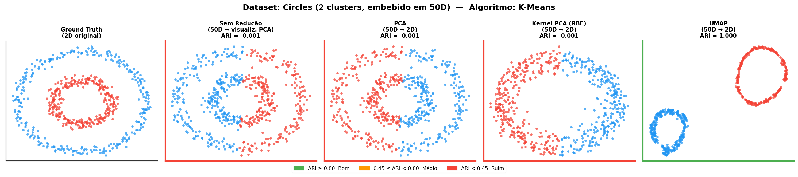
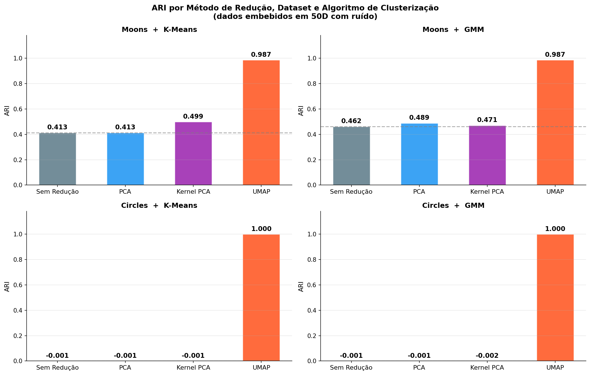
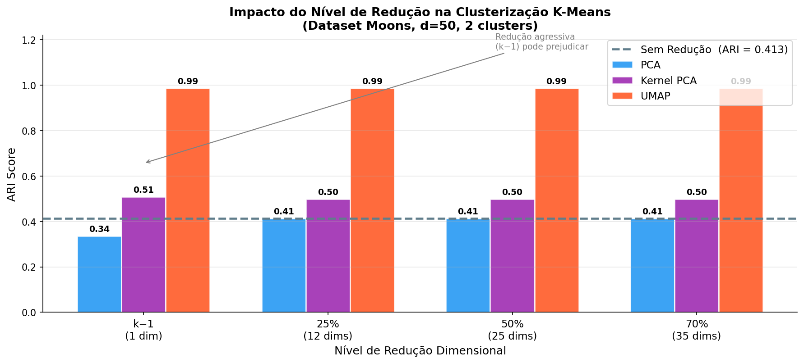

------------------------------------------------------------------------

# Motivação: A Maldição da Dimensionalidade

O avanço de pesquisas e trabalhos que utilizam dados com grande dimensionalidade, possibilitado pela facilidade da obtenção e armazenamento desses dados, como em genética e comportamentos sociais trouxe uma necessidade de simplificar o processo, compreender as variáveis que trazem informação ao estudo e agrupar casos similares para tornar a explicação mais clara.

O estudo de métodos de redução de dimensionalidade junto com técnicas de clusterização se tornou essencial, mas a literatura, porém, tem algumas lacunas de trabalhos abordando os efeitos da utilização conjunta dessas técnicas. É nesse sentido que desejamos investigar essas lacunas e testar algoritmos em conjunto para avaliar seus desempenhos.

## O Fenômeno

Em espaços de alta dimensão, a geometria quebra de formas contraintuitivas. A intuição construída em 2D ou 3D falha completamente — e os algoritmos de clustering, que dependem de noções de *proximidade* e *distância*, são as primeiras vítimas.

> *"Data points become nearly equidistant and classical notions of similarity lose discriminative power"* — Amate et al. (2026)

**O problema em espaços de alta dimensão:**

- Distâncias euclidianas entre pares de pontos convergem para o mesmo valor
- K-Means, AHC e GMM dependem de distância -\> estrutura de clusters desaparece
- A separação entre clusters fica indistinguível do ruído
- Redução não é pré-processamento opcional, é o que restaura o sinal

## Concentração de Distâncias

Para $x_1, \ldots, x_n \overset{iid}{\sim} \mathcal{N}(0, I_d)$, a distância quadrática entre dois pontos é:

$$d_{ij}^2 = \|x_i - x_j\|_2^2 = \sum_{k=1}^{d}(x_{ik} - x_{jk})^2$$

Cada parcela $(x_{ik} - x_{jk})^2$ segue distribuição $\chi^2(1)$. Pela **Lei dos Grandes Números**:

$$\frac{d_{ij}^2}{d} \xrightarrow{\;a.s.\;} \mathbb{E}[(x_{ik} - x_{jk})^2] = 2, \quad d \to \infty$$

Portanto $d_{ij} \approx \sqrt{2d}$ para todo par de pontos. O **coeficiente de variação** das distâncias:

$$\text{CV}[d_{ij}] = \frac{\text{SD}[d_{ij}]}{\mathbb{E}[d_{ij}]} \;\sim\; \frac{1}{\sqrt{d}} \;\xrightarrow{d \to \infty}\; 0$$

::: callout-important
## Interpretação

Todas as distâncias concentram-se em torno de $\sqrt{2d}$. Com $d = 500$, a variação relativa é ≈ 3%. Pontos próximos e distantes tornam-se igualmente "distantes" — a noção de vizinhança colapsa.
:::

```{r}
# Verificação empírica: CV das distâncias cai com 1/sqrt(d)
set.seed(42)
dims <- c(2, 5, 10, 20, 50, 100, 200, 500)

for (d in dims) {
  pts   <- matrix(rnorm(400 * d), 400, d)
  dists <- as.vector(dist(pts))
  cv    <- sd(dists) / mean(dists)
  cat(sprintf("d = %4d  |  CV = %.4f  |  1/sqrt(d) = %.4f\n",
              d, cv, 1/sqrt(d)))
}
```

| $d$ | $\text{CV}[d_{ij}]$ empírico | $1/\sqrt{d}$ teórico |
|----:|:----------------------------:|:--------------------:|
|   2 |            0.4472            |        0.7071        |
|  10 |            0.2094            |        0.3162        |
|  50 |            0.0993            |        0.1414        |
| 100 |            0.0702            |        0.1000        |
| 500 |            0.0314            |        0.0447        |

## Teorema de Beyer et al. (1999)

**Condição formal para a instabilidade dos vizinhos mais próximos:**

Seja $D_{\max}(q)$ e $D_{\min}(q)$ as distâncias máxima e mínima de uma consulta $q$ a $n$ pontos. Sob condições gerais sobre a distribuição dos dados:

$$\lim_{d \to \infty} \Pr\!\left[\frac{D_{\max}(q) - D_{\min}(q)}{D_{\min}(q)} < \varepsilon\right] = 1, \quad \forall\,\varepsilon > 0$$

**Consequência direta:** o vizinho mais próximo torna-se tão distante quanto qualquer outro ponto — algoritmos como KNN, K-Means e DBSCAN perdem completamente a capacidade discriminativa.

```{r}
# Razão (D_max - D_min) / D_min decresce com a dimensão
set.seed(42)
dims <- c(2, 5, 10, 20, 50, 100, 500)

for (d in dims) {
  pts   <- matrix(rnorm(200 * d), 200, d)
  query <- matrix(rnorm(d), 1, d)
  dists <- sqrt(rowSums(sweep(pts, 2, query)^2))
  ratio <- (max(dists) - min(dists)) / min(dists)
  cat(sprintf("d = %4d  | (Dmax-Dmin)/Dmin = %.4f\n", d, ratio))
}
```

## Concentração de Volume na Hiperesfera

A fração do volume de uma bola $d$-dimensional de raio $R$ contida na casca exterior de espessura $\delta$:

$$F(d,\, \delta/R) = 1 - \left(1 - \frac{\delta}{R}\right)^{\!d}$$

Com $\delta/R = 0.01$ (apenas 1% do raio), a fração que fica **fora** do núcleo:

```{r}
delta_R <- 0.01
dims    <- c(2, 10, 50, 100, 500, 1000)

data.frame(
  d    = dims,
  frac = round(1 - (1 - delta_R)^dims, 5)
)
```

|   $d$ | $F(d,\; 0.01)$ |
|------:|:--------------:|
|     2 |      2.0%      |
|    10 |      9.6%      |
|    50 |     39.5%      |
|   100 |     63.4%      |
|   500 |     99.3%      |
| 1 000 |  **\>99.99%**  |

Praticamente **todo o volume** migra para a superfície da hiperesfera. Consequência imediata para clustering: não existem pontos "centrais", qualquer centróide $\mu_k$ está longe de quase todos os membros do seu cluster.

## Impacto Direto no Clustering

**Por que K-Means, AHC e GMM degradam com a dimensão?**

A inércia total do K-Means decompõe-se em variância *within* e *between* clusters:

$$\underbrace{\sum_{i=1}^n \|x_i - \bar{x}\|^2}_{\text{Inércia total}} = \underbrace{\sum_{k=1}^K \sum_{i \in C_k} \|x_i - \mu_k\|^2}_{\text{Within-cluster } (W)} + \underbrace{\sum_{k=1}^K n_k\|\mu_k - \bar{x}\|^2}_{\text{Between-cluster } (B)}$$

O K-Means maximiza implicitamente a razão $B/W$. Em alta dimensão, a razão **sinal/ruído** desta decomposição:

$$\text{SNR}_d = \frac{B - W}{W} \;\sim\; \frac{\Delta}{\sqrt{d}}$$

onde $\Delta$ é a separação intrínseca dos clusters no espaço original. Com $d = 50$ e separação $\Delta = 1$:

$$\text{SNR}_{2} = 1.00 \qquad \longrightarrow \qquad \text{SNR}_{50} \approx \frac{1}{\sqrt{50}} \approx 0.14$$

::: callout-warning
## Por que redução de dimensionalidade é essencial

A mesma separação que é *óbvia* em 2D torna-se *invisível* em 50D. A redução dimensional restaura o SNR ao eliminar as dimensões que contribuem apenas com ruído, permitindo que $B/W$ volte a discriminar os clusters.
:::

## Evidência Visual

{fig-align="center"}

------------------------------------------------------------------------

# O Estudo: Amate et al. (2026)

## Escopo e Desenho Experimental

::::: columns
::: {.column width="50%"}
**Métodos de Redução Avaliados no Artigo**

| Família       | Método           |
|---------------|------------------|
| Linear        | PCA              |
| Kernel        | Kernel PCA (RBF) |
| Manifold      | Isomap, MDS      |
| Deep Learning | VAE              |

*t-SNE e UMAP foram excluídos por serem estocásticos e sensíveis a hiperparâmetros — tornam a comparação controlada mais difícil.*
:::

::: {.column width="50%"}
**Algoritmos de Clusterização**

| Algoritmo | Tipo                 |
|-----------|----------------------|
| K-Means   | Centróide            |
| AHC       | Hierárquico (Ward)   |
| GMM       | Probabilístico (EM)  |
| OPTICS    | Baseado em densidade |

**Datasets**

- 1 165 datasets sintéticos gerados com *repliclust*
- 20 datasets reais do repositório UCI
:::
:::::

## Pipeline Experimental

```         
Dados brutos
    │
    ▼
[Normalização z-score]
    │
    ├──────────── Sem redução ──────────────────────────────┐
    │                                                        │
    ▼                                                        │
[DR: PCA | Kernel PCA | VAE | Isomap | MDS]               │
    │  Níveis: k−1  |  25% de d  |  50% de d               │
    ▼                                                        │
[Clustering: K-Means | AHC | GMM | OPTICS] ◄───────────────┘
    │
    ▼
[ARI vs. Ground Truth → comparação com e sem DR]
```

**Níveis de redução testados:**

| Nível | Dimensões (d=50) | Racional |
|------------------------|:----------------------:|------------------------|
| **k − 1** | 1 | Limite teórico de Ding & He (2004): subspace bound para K-Means |
| **25% de d** | 12 | Literatura de clustering textual |
| **50% de d** | 25 | Prática comum com PCA aplicado |

## Métrica de Avaliação: ARI

O **Adjusted Rand Index** mede a concordância entre a partição obtida e o ground truth, corrigida pelo acaso:

$$\text{ARI} = \frac{\text{RI} - \mathbb{E}[\text{RI}]}{\max(\text{RI}) - \mathbb{E}[\text{RI}]} \in [-1,\; 1]$$

onde o Rand Index base é:

$$\text{RI} = \frac{a + b}{\binom{n}{2}}, \quad a = \text{pares no mesmo cluster em ambas as partições}, \quad b = \text{pares em clusters diferentes em ambas}$$

::::: columns
::: {.column width="50%"}
| Valor      | Interpretação                     |
|------------|-----------------------------------|
| **1.0**    | Partição perfeita                 |
| **≈ 0.0**  | Aleatório / não melhor que chance |
| **\< 0.0** | Pior que aleatório                |
:::

::: {.column width="50%"}
**Vantagens do ARI:**

- Ajustado para chance (sem viés com $K$ grande)
- Labels não precisam corresponder entre partições
- Aplicável a todos os datasets com ground truth
- Simétrico: $\text{ARI}(U, V) = \text{ARI}(V, U)$
:::
:::::

::: callout-note
Na visualização: **borda verde** = ARI ≥ 0.80 (bom) · **laranja** = 0.45–0.80 (médio) · **vermelha** \< 0.45 (ruim)
:::

------------------------------------------------------------------------

# Demonstração Prática

## Configuração

O experimento cria clusters **2D não-lineares** (Moons e Circles), embute-os em **50 dimensões** via projeção aleatória com ruído, e compara o ARI do K-Means em quatro condições: sem redução, PCA, Kernel PCA e UMAP.

```{r}
library(kernlab)   # Kernel PCA
library(umap)      # UMAP
library(mclust)    # GMM + adjustedRandIndex()

SEED <- 42

make_moons <- function(n = 600, noise = 0.08) {
  n2    <- n %/% 2
  theta <- seq(0, pi, length.out = n2)
  X <- rbind(
    cbind(cos(theta),       sin(theta)),
    cbind(1 - cos(theta),   1 - sin(theta) - 0.5)
  )
  X + matrix(rnorm(n * 2, sd = noise), n, 2)
}

make_circles <- function(n = 600, noise = 0.05, factor = 0.45) {
  n2    <- n %/% 2
  theta <- runif(n, 0, 2 * pi)
  r     <- c(rep(1, n2), rep(factor, n - n2))
  cbind(r * cos(theta), r * sin(theta)) +
    matrix(rnorm(n * 2, sd = noise), n, 2)
}

gerar_dados <- function(n = 600, d = 50, dataset = "moons") {
  set.seed(SEED)
  X2d <- if (dataset == "moons") make_moons(n) else make_circles(n)
  X2d <- scale(X2d)
  y   <- c(rep(0L, n %/% 2), rep(1L, n - n %/% 2))
  # Johnson-Lindenstrauss: 2D → d dimensões com ruído
  P   <- matrix(rnorm(2 * d), 2, d) / sqrt(2)
  Xhd <- X2d %*% P + matrix(rnorm(n * d, sd = 0.35), n, d)
  list(X2d = X2d, Xhd = scale(Xhd), y = y)
}
```

::: callout-tip
## Johnson-Lindenstrauss

A projeção `Xhd = X2d %*% P` preserva aproximadamente as distâncias entre pontos (lema JL). O sinal 2D está presente em 50D, mas diluído em 48 dimensões de ruído gaussiano.
:::

## As Três Reduções

```{r}
reduzir <- function(Xhd, metodo = "pca", n_comp = 2) {
  switch(metodo,

    pca = {
      # Linear: projeta nas direções de máxima variância
      prcomp(Xhd, center = FALSE)$x[, seq_len(n_comp)]
    },

    kpca = {
      # Kernel trick: K_ij = exp(−σ ||xi − xj||²)
      # Aplica PCA no espaço de features implícito do kernel RBF
      fit <- kpca(Xhd, kernel = "rbfdot", features = n_comp)
      rotated(fit)
    },

    umap = {
      # Constrói grafo de k-vizinhos e otimiza embedding topológico
      set.seed(SEED)
      cfg              <- umap.defaults
      cfg$n_components <- n_comp
      cfg$n_neighbors  <- 15
      cfg$min_dist     <- 0.1
      umap(Xhd, config = cfg)$layout
    }
  )
}

clusterizar <- function(X, k = 2, algoritmo = "kmeans") {
  set.seed(SEED)
  if (algoritmo == "kmeans")
    kmeans(X, centers = k, nstart = 30)$cluster - 1L
  else
    Mclust(X, G = k, verbose = FALSE)$classification - 1L
}
```

## Resultados — Moons (50 dimensões)

{fig-align="center" width="100%"}

## Resultados — Circles (50 dimensões)

{fig-align="center" width="100%"}

## Por que PCA Falha e UMAP Acerta?

::::: columns
::: {.column width="50%"}
**PCA — falha**

1.  Projeta nas direções de **maior variância linear**
2.  Em 50D, as 48 dimensões de ruído contribuem variância comparável ao sinal 2D
3.  Os 2 PCs dominantes capturam ruído, não a estrutura de meia-lua
4.  Resultado: ARI ≈ 0.41 (Moons) · 0.00 (Circles)

**Kernel PCA — melhora parcialmente**

- Kernel RBF detecta relações não-lineares locais
- Mas $\sigma = 1/d$ padrão pode subestimar a escala intrínseca
- Melhora Moons levemente; não resolve Circles
:::

::: {.column width="50%"}
**UMAP — acerta**

1.  Constrói **grafo de** $k$-vizinhos no espaço 50D
2.  Cada ponto conecta aos 15 vizinhos mais próximos
3.  Otimiza embedding 2D preservando esse grafo topológico
4.  A estrutura de meia-lua/anel é **robusta localmente** mesmo com ruído global dominante

| Método     |   Moons   |  Circles  |
|------------|:---------:|:---------:|
| Sem DR     |   0.413   |   0.000   |
| PCA        |   0.413   |   0.000   |
| Kernel PCA |   0.499   |   0.000   |
| **UMAP**   | **0.987** | **1.000** |
:::
:::::

------------------------------------------------------------------------

# Resultados do Artigo

## Comparação Multi-Dataset × Multi-Algoritmo

{fig-align="center" width="90%"}

## Dados Sintéticos — Achados por Algoritmo

**K-Means**

- Kernel PCA vence em 73% dos datasets sintéticos (ganho médio +18% de ARI no nível 50%)
- PCA performa como baseline — ganho negligenciável
- VAE instável: ARI médio negativo em Circles e Moons

**AHC (Hierárquico)**

- Isomap é o melhor no geral (+13% em 50%). Kernel PCA competitivo e consistente
- VAE **prejudica** AHC. A representação probabilística distorce as distâncias de ligação do Ward

**GMM**

- Isomap novamente o melhor (62% de vitórias, +16% de ARI)
- Kernel PCA também forte; MDS e VAE instáveis

**OPTICS**

- Todos os DRs **perdem** para o baseline nos sintéticos
- Em dados reais, Kernel PCA (+7% no nível k−1) e VAE (+4.6%) surpreendem

## Dados Reais (20 datasets UCI)

| Algoritmo | Melhor DR | Observação |
|------------------------|------------------------|------------------------|
| **K-Means** | *(baseline)* | DR raramente melhora; Kernel PCA chega a −9% de ARI |
| **AHC** | Kernel PCA (k−1) | Único com vantagem consistente: 66.7% dos datasets |
| **GMM** | Isomap (50%) | PCA tem vitórias pontuais (ex.: Iris +0.18 ARI) |
| **OPTICS** | Kernel PCA (k−1) | 73% de vitórias; VAE tem alta taxa mas variância enorme |

::: callout-warning
## Teste de Wilcoxon (Tabela A.9 do artigo)

Apenas **Kernel PCA + OPTICS** mostrou significância estatística (p \< 0.05) nos níveis k−1 e 25%. Os demais ganhos podem ser acidentais.
:::

## Impacto do Nível de Redução

{fig-align="center" width="90%"}

**Interpretação:**

| Nível   | Dims (d=50) | Resultado                                        |
|---------|:-----------:|--------------------------------------------------|
| **k−1** |      1      | Muito agressivo — destrói sinal junto com ruído  |
| **25%** |     12      | Bom equilíbrio sinal/ruído                       |
| **50%** |     25      | **Melhor desempenho médio** na maioria dos casos |
| 70%     |     35      | Benefício marginal; mantém ruído excessivo       |

------------------------------------------------------------------------

# Recomendações Práticas

## Guia de Seleção: DR × Algoritmo

```         
Minha estrutura é não-linear?
        │
        ├─ SIM ─► Kernel PCA ou Isomap  (nível: 25–50%)
        │          Dados de manifold → considerar UMAP*
        │
        └─ NÃO ─► PCA como baseline confiável
                   (performance similar a sem redução)


Qual algoritmo de clustering?
┌─────────────┬────────────────────────────────────────────────────┐
│ K-Means     │ Isomap ou PCA — baixo risco, ganho moderado        │
│ AHC         │ Kernel PCA (melhor), depois Isomap                 │
│ GMM         │ Isomap (50%) ou Kernel PCA — curvature-aware       │
│ OPTICS      │ Kernel PCA (k−1) — validar vizinhança antes        │
└─────────────┴────────────────────────────────────────────────────┘
```

------------------------------------------------------------------------

# Conclusões

## Três Achados Principais

**1. O par DR + algoritmo é decisivo**

Não existe método universal. O mesmo DR pode ser o melhor e o pior dependendo do algoritmo de clustering — a escolha errada pode custar até 25% de ARI.

**2. Redução moderada supera os extremos**

O nível 25–50% das features oferece o melhor equilíbrio sinal/ruído. k−1 é agressivo demais; redução insuficiente mantém o problema original.

**3. Domínio importa: sintéticos ≠ reais**

Ganhos em dados sintéticos não garantem ganhos em dados reais heterogêneos.

# Referências

- Amate, Bakhtyari, Roy & Makarenkov (2026). *Assessing the impact of dimensionality reduction on clustering performance — a systematic study.* arXiv:2604.22099

- Beyer, Goldstein, Ramakrishnan & Shaft (1999). When is "nearest neighbor" meaningful? *ICDT*, LNCS 1540, 217–235.

- Ding & He (2004). K-means clustering via principal component analysis. *ICML*, 225–232.

- McInnes & Healy (2018). UMAP: Uniform Manifold Approximation and Projection for dimension reduction. *arXiv:1802.03426*
